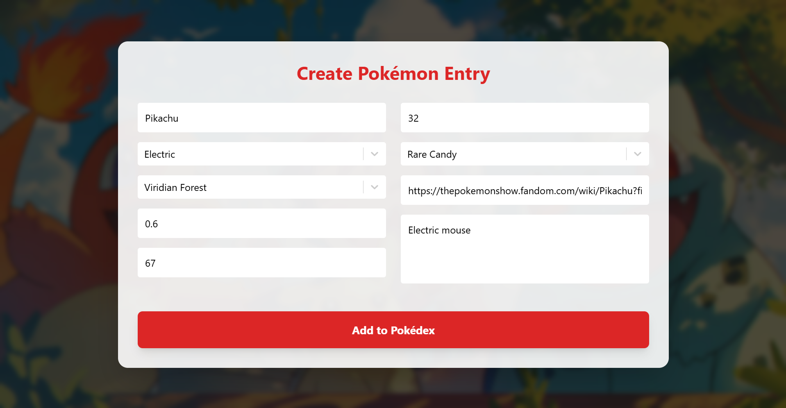
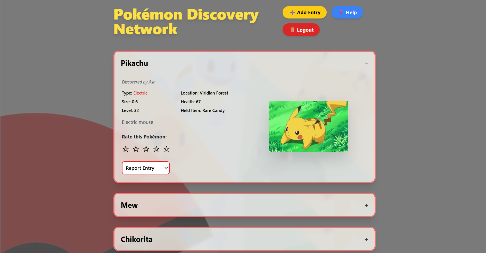
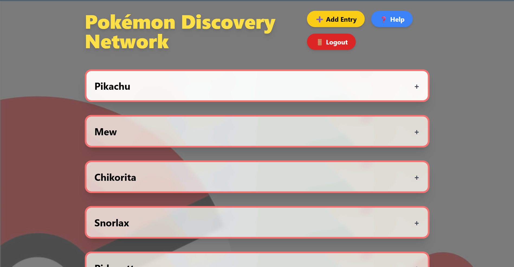
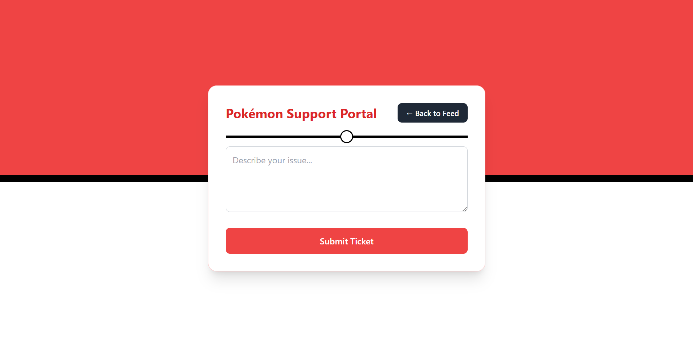
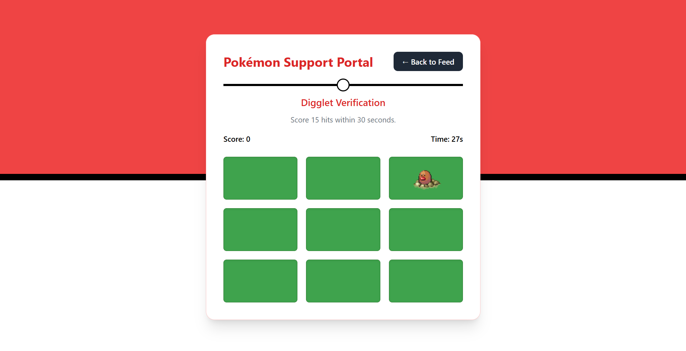
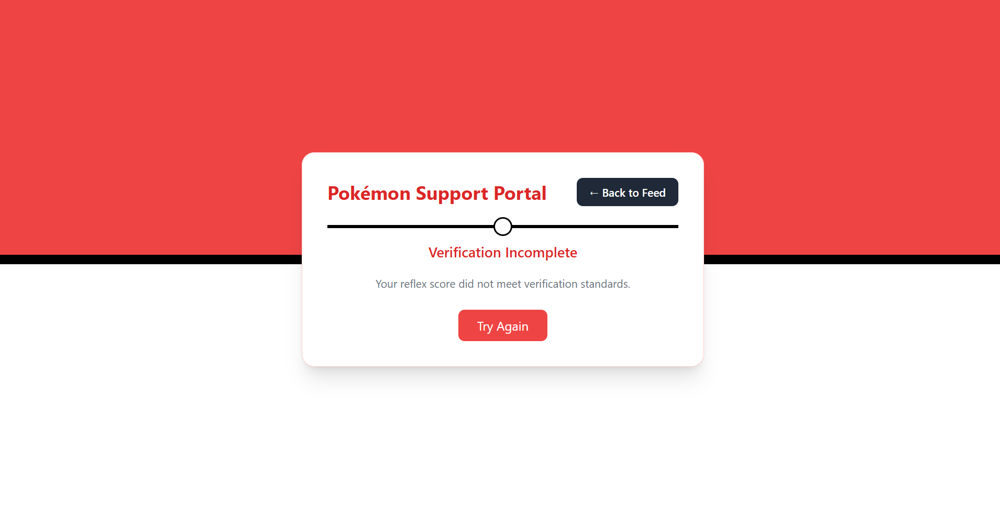
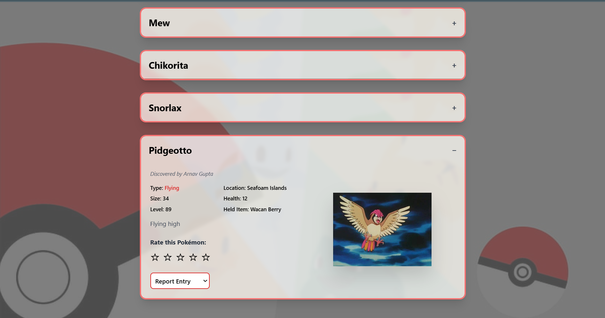
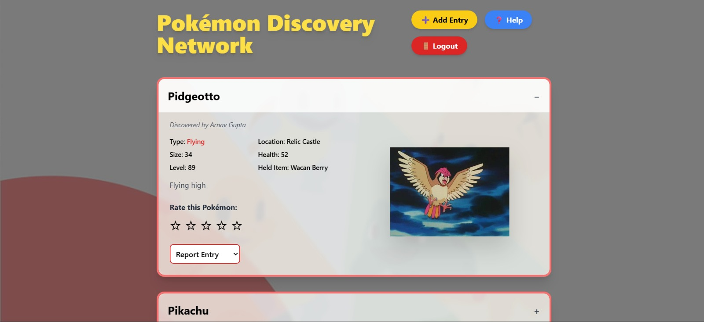
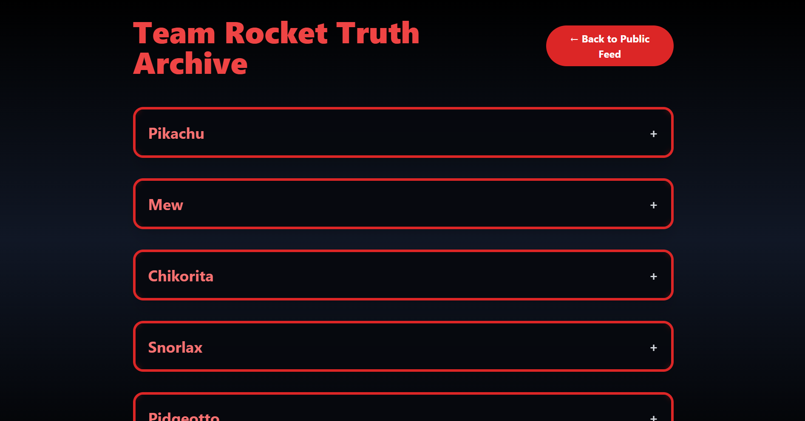
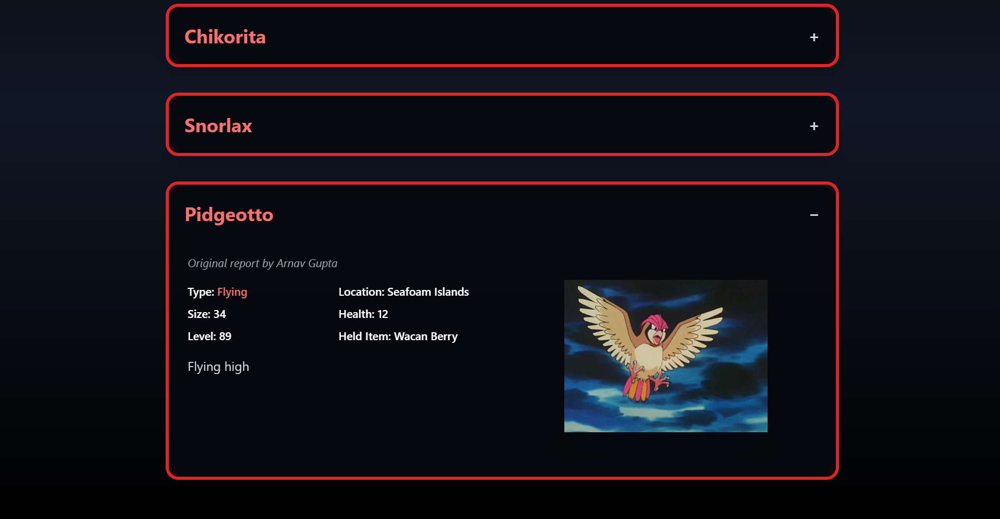

# Noobathon 2026  
## Team Rocket's Evil Masterplan

A Pokémon-themed misinformation platform built for Noobathon Hackathon 2026.

---
## Steps to Run
Clone the repository then run
```bash
cd Frontend && npm run dev
```
and
```bash
cd backend && node server.js
```
in 2 seperate terminals
Website will be online on http://localhost:5173
---
## Authentication

### Login Page


### Sign Up Page


---

## Create Post



---

## Feed Page

### Expanded View


### Collapsed View


---

## Help System (Team Rocket Edition)

### Help Query Page


### Mini Game


### Retry Screen


---

## Reporting System

### Before Reporting


### After Reporting


---

## Personalized Misinformation

Different users see different manipulated data.

### User 1 View
.jpeg)

### User 2 View
.png)

---

## Team Rocket Secret Portal
Type isbaarhumfailnahihonge in feed to access Team Rocket's Portal
### Portal Access


### Truth (Team Rocket View)


### Normal User View (Manipulated)
.jpeg)
